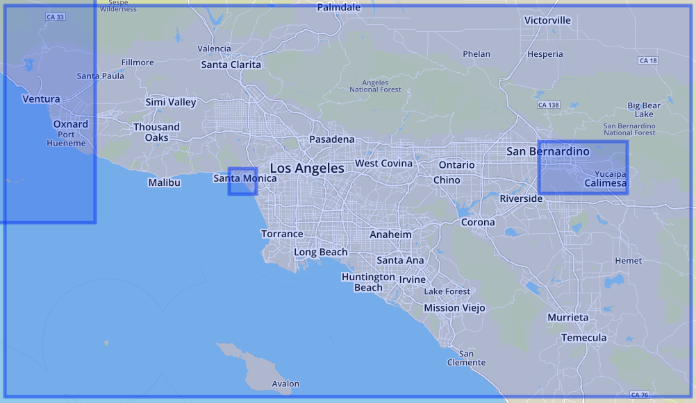

####The Map Data

Downloaded OSM Data from https://mapzen.com/data/metro-extracts for a large area surrounding the Los Angeles metro area, including my current town of residence, Pasadena. The bounding box for the map data I used is the largest blue square that’s lined up with the screen shot. The size of the data file that I worked with was 1.21 GB. For the project submission, I included every 150th top-level node, bringing the data file down to 8.2 MB.

